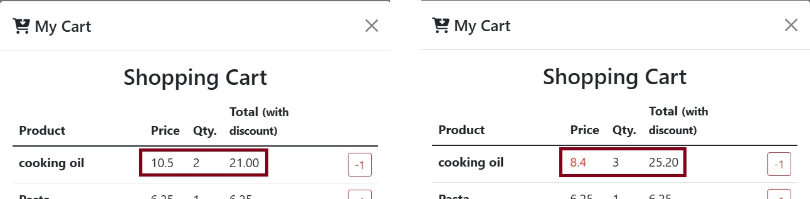
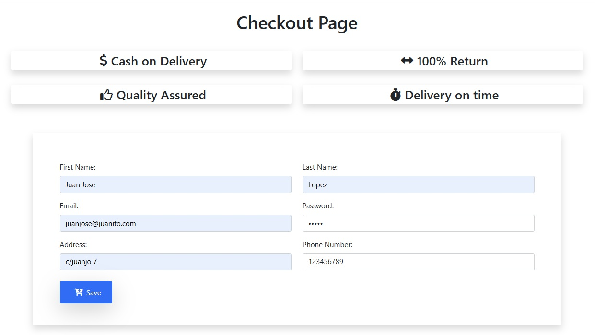

# 🏬 Sprint 2 IT Academy | E-commerce Demo

## Introduction

A proof of concept web application for an **e-commerce** company, focused on shopping cart management and applying dynamic promotions on the final price. Also included is basic Checkout form validation.
Sprint 2.2 IT Academy.

<br>

## Table of contents
1. [🚀 Starting](#starting)
    * [Requirements](#Requirements)
    * [Installation](#Installation)
2. 📁 [Folder structure](#folder-structure)
2.  [📝 Features](#features)
3.  [💻 Technologies Used](#technologies-used)
4.  [📂 Project Structure](#project-structure)
5.  [🤝 Contributions and Contact](#Contributions)

<br>

## 🚀 Starting
How to start the project
### Requirements
This project can be run directly in any modern web browser, as it only uses HTML, CSS, and JavaScript files.
* **Modern Web Browser** (Chrome, Firefox, Edge, Safari, etc.)
* (Optional, but recommended) **Live Server** or similar to serve the files locally.
### Installation
No external dependencies are required. The project can be run directly in the browser.

1.  Go to the local folder where you want to clone the repository.
2.  Clone the repository with the bash terminal:
```bash
$ git clone https://github.com/JEspinosa1770/Sprint2_2-Frontend-shop
```
3. Go to the folder of the project
```bash
$ cd Sprint2_2-Frontend-shop
```
4. Open the index.html with your preferred browser

<br>

## 📁 Folder structure
General outline of the exercise folder structure.


<br>

## 📝 Features
The main logic of the application is found in the files `js/shop.js` and `js/checkout.js`.
### Shopping Cart Management (`js/shop.js`)

<div width='50%' style='text-align: center'>

<p>

**Adding products to the cart (`buy()`):** Allows you to add products to the cart, managing the quantity if the product exists.</p></div>
<br>
<div width='50%' style='text-align: center'>

<p>

**Emptying the cart (`cleanCart()`):** Resets the cart's variable.</p></div>
<br>
<div width='50%' style='text-align: center'>

<p>

**Show cart (`printCart()`):** Dynamically render the products of the cart in the modal, including prices, quantities and subtotals.</p></div>
<br>
<div width='50%' style='text-align: center'>

<p>

**Subtract/Eliminate products (`removeFromCart()`):** Allows you to decrease the quantity of a product from the cart or remove it completely if the quantity is 1.</p></div>
<br>
<div width='50%' style='text-align: center'>

<p>

**Calculation of the Total (`calculateTotal()`):** Calculates the total sum of the products with discounts, highlighting in red the price that has a discount applied.</p></div>
<br>
<div width='50%' style='text-align: center'>

<p>

**Promotions Application (`applyPromotionsCart()`):** Modify the shopping cart amounts based on whether the criteria for applying offers for different products are met.</p></div>


### Checkout Form Validation (`js/checkout.js`)
Form validation has been implemented for `checkout.html` to ensure that all fields meet the required conditions.

<div width='50%' style='text-align: center'>

</div>

**Validation Conditions:**
* Required fields (minimum 3 characters).
* First and Last Name: Letters only.
* Phone: Numbers only.
* Password: Letters and numbers, and 4 to 8 characters.
* Email: Valid email format.
* **User Feedback:** Errors are highlighted with Bootstrap's `is-invalid` class and dynamic error messages are displayed below the input.
### Layout
A **professional layout** has been performed to improve the visual appearance of the demo.
<div width='50%' style='text-align: center'>

</div>

<br>

## 💻 Technologies Used
* **HTML5**
* **CSS3** (With predefined styles from the *starter code*)
* **JavaScript (ES6+)** - Main logic
* **Bootstrap** - Styling and UI components (modal, forms, etc.)
* **Hardcoded Data** - Array of 9 sample products in `js/shop.js`

<br>

## 📂 Project Structure
The implemented logic is in:
* `js/shop.js`: Shopping cart logic, calculations and prints. Data array of the 9 example products.
* `js/checkout.js`: Checkout form validation logic.
* `index.html`: Main page of the store.
* `checkout.html`: Checkout form.

<br>

<a name="item5"></a>

## 🤝 Contributions and Contact
This project has been developed by **Jordi Espinosa** as part of an e-commerce exercise.

Any suggestions or queries, please feel free to contact: **[JEspinosa](https://github.com/JEspinosa1770)**
